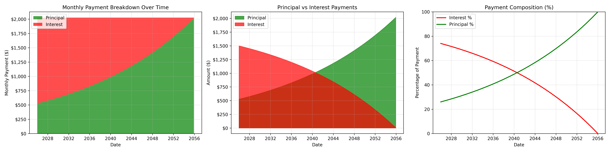
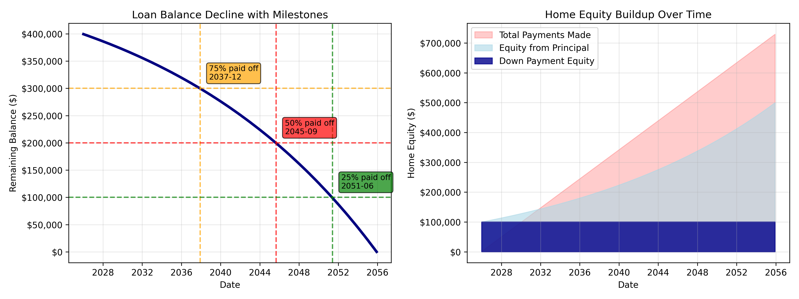

# Mortgage Analysis
André Guerra<br>
August, 20205


<!-- AUTO-GENERATED SUMMARY START -->
## 🏠 Mortgage Analysis Executive Summary

### Loan Overview
- **Home Price**: $500,000.00
- **Down Payment**: $100,000.00 (20.0%)
- **Loan Amount**: $400,000.00
- **Interest Rate**: 4.500%
- **Loan Term**: 30 years
- **Monthly Payment**: $2,026.74
### Financial Summary
- **Average Monthly Cost**: $2,304.52
- **Total Interest Paid**: $329,626.85
- **Total Payments Made**: $729,626.85
- **Total Home Cost**: $829,626.85
- **Interest as % of Home Price**: 65.9%
- **Loan-to-Home Price Ratio**: 80.00%
- **Break-even Point**: 2042-03

### Recommendations
*TODO*

### Conclusion
*TODO*

*Last updated: 2025-08-31 23:22:40*
<!-- AUTO-GENERATED SUMMARY END -->


<!-- AUTO-GENERATED MORTGAGE ANALYSIS START -->
## 🏠 Mortgage Analysis Results

### Key Financial Metrics
- **Total Interest Cost**: $329,627
- **Interest Multiplier**: 1.82x (pay $1.82 for every $1 borrowed)
- **Total Home Cost**: $829,627

### Loan Parameters
| Parameter | Value |
|-----------|-------|
| 🏠 **Home Price** | $500,000.00 |
| 💰 **Down Payment** | $100,000.00 (20.0%) |
| 📊 **Loan Amount** | $400,000.00 |
| 📈 **Interest Rate** | 4.50% |
| ⏰ **Loan Term** | 30 years |
| 💳 **Monthly Payment** | $2,026.74 |

### Cost Breakdown Analysis
| Metric | Amount | Percentage |
|--------|--------|------------|
| **Original Loan** | $400,000.00 | 48.2% of total cost |
| **Interest Payments** | $329,626.85 | 82.4% of loan |
| **Down Payment** | $100,000.00 | 12.1% of total cost |
| **Total Home Cost** | $829,626.85 | 65.9% above home price |

### Payment Analysis
| Timeframe | Interest Paid | Key Insight |
|-----------|---------------|-------------|
| **First 10 Years** | $163,566.66 | Front-loaded interest period |
| **Last 10 Years** | $47,650.07 | Principal-heavy period |
| **Front-Loading Ratio** | 3.4:1 | Early years pay 3.4x more interest |

### Equity & Milestones
| Milestone | Timeline | Details |
|-----------|----------|---------|
| **50% Equity Point** | 2042-03 | Break-even point for home equity |
| **Average Monthly Cost** | $2,304.52 | Total cost ÷ 30 years |
| **Interest as % of Home** | 65.9% | Interest relative to home value |

### 📊 Summary Statistics
```
Loan Information:
├── Home Price:                 $500,000.00
├── Down Payment:               $100,000.00 (20.0%)
├── Loan Amount:                $400,000.00
├── Interest Rate:              4.500%
└── Monthly Payment:            $2,026.74

Payback Analysis:
├── Total Amount Paid:          $729,626.85
├── Total Interest:             $329,626.85
├── Interest Multiplier:        1.82x
├── Interest % of Loan:         82.4%
└── For every $1 borrowed:      Pay $1.82

Cost Distribution:
├── First 5 Years Interest:     $86,236.14
├── First 5 Years Principal:    $35,368.33
├── Early Interest Burden:      26.2% of total
└── Early Principal Progress:   8.8% of loan
```

### 🎯 Key Insights
- **Interest Front-Loading**: You pay **3.4x more interest** in the first 10 years compared to the last 10 years
- **True Cost**: The home actually costs **$829,627** (65.9% more than the list price)
- **Interest Burden**: Interest represents **39.7%** of your total home cost
- **Break-Even**: You'll own 50% equity in **2042-03**

*Last updated: 2025-08-31 23:22:40*
<!-- AUTO-GENERATED MORTGAGE ANALYSIS END -->


## Amortization Schedule
<p align="middle">
    
</p>

## Amortization Breakdown
<p align="middle">
    
</p>

## Equity Build up
<p align="middle">
    
</p>

## Loan Cost Break-down
<p align="middle">
    
</p>

## Payback Interest Analysis
<p align="middle">
    
</p>


<!-- AUTO-GENERATED ANALYSIS START -->
## 📊 Investment Analysis Results

### Key Findings
- **Total Interest Cost**: $329,626.85
- **Potential Investment Gains**: $2,414,175.05
- **Total Opportunity Cost**: $2,743,801.90

### Detailed Breakdown

#### Loan Parameters
```
Home Price:          $500,000.00
Loan Amount:         $400,000.00
Interest Rate:       4.50%
Loan Term:           30 years
Monthly Payment:     $2,026.74
```

#### Investment Analysis (S&P 500 @ 10% annual return)
```
Total Interest Payments:     $329,626.85
Final Investment Value:      $2,743,801.90
Investment Gains:            $2,414,175.05
Investment ROI:              732.4%
Break-even Time:             0.2 years
```

#### Economic Impact
```
Interest Cost:               $329,626.85
Missed Investment Gains:     $2,414,175.05
Total Opportunity Cost:      $2,743,801.90
Opportunity Cost (% of loan): 686.0%
```

*Last updated: 2025-08-31 23:22:54*
<!-- AUTO-GENERATED ANALYSIS END -->


<p align="middle">
    
</p>
